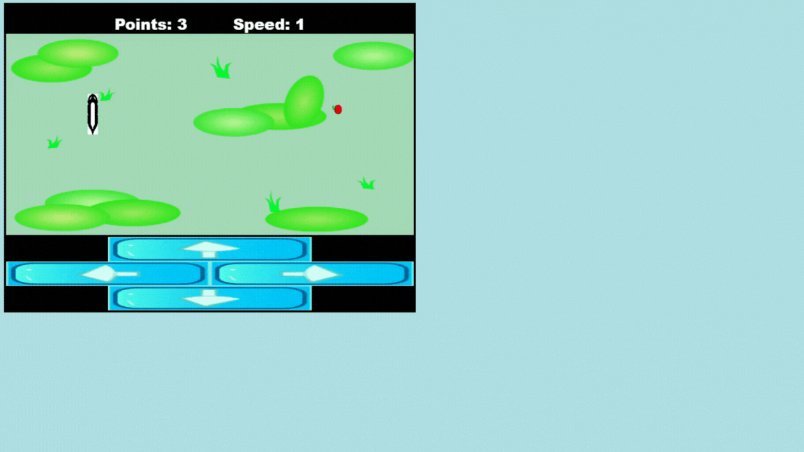

# Projeto Jogo da cobrinha

> Projeto: Jogo da cobrinha utilizando Html e JavaScript.

O projeto "Jogo da Cobrinha" desenvolvido por Arthur Covelo é uma implementação clássica e divertida do popular jogo Snake, onde os jogadores controlam uma cobrinha que cresce ao comer comida e deve evitar colidir com as paredes ou com seu próprio corpo.

 O jogo é construído utilizando a linguagem de marcação HTML e é uma excelente demonstração de como conceitos de programação podem ser aplicados de forma prática e criativa.

 ## Recursos do Projeto

### Estrutura HTML
O jogo utiliza a estrutura básica do HTML para criar o tabuleiro de jogo. 
Elementos HTML são usados para representar a cobrinha, a comida e o espaço de jogo.

### Controles com JavaScript
A interatividade do jogo é implementada por meio do JavaScript. Os jogadores podem controlar a direção da cobrinha usando as teclas de seta do teclado.

### Lógica do Jogo
O JavaScript também é utilizado para a implementação da lógica do jogo. Isso inclui verificar colisões da cobrinha com as bordas do tabuleiro e com ela mesma, além de gerar aleatoriamente a comida.

### Crescimento da Cobrinha
Conforme a cobrinha come a comida, ela cresce de tamanho. A lógica de crescimento é implementada em JavaScript para garantir um aumento gradual da dificuldade.

### Pontuação e Desafio
O jogo mantém um sistema de pontuação, incentivando os jogadores a superarem seus recordes anteriores. À medida que a cobrinha cresce, o jogo se torna mais desafiador.

[🔗 Clique aqui para jogar!!!](https://arthurcovelo.github.io/Jogo-da-Cobrinha/)
## 🛠 Tecnologias

- Html
- JavaScript
- Git e Github

## 🖤 Contato

Arthurcovelo@gmail.com

[🔗 Clique aqui para acessar](https://arthurcovelo.github.io/ProjetoWeb_Profile/)

